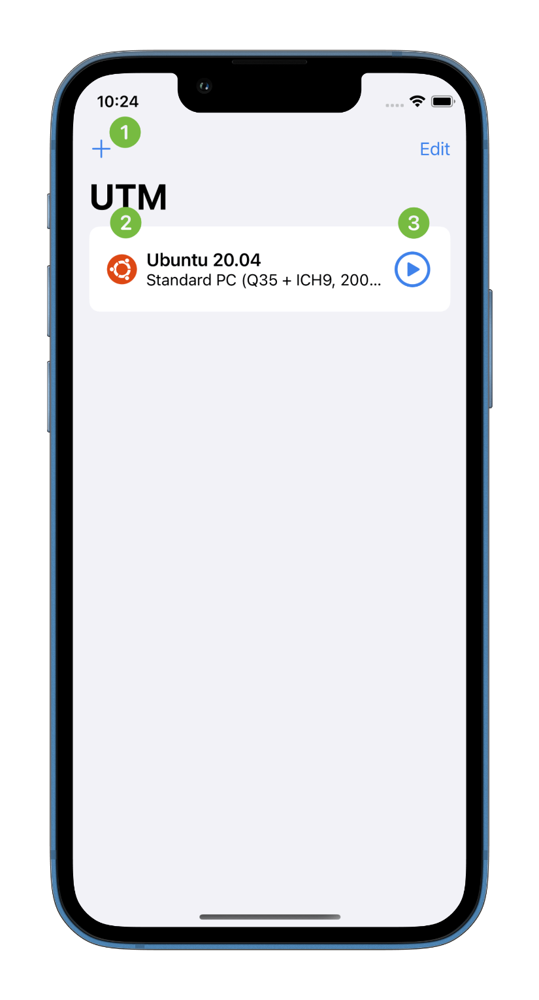
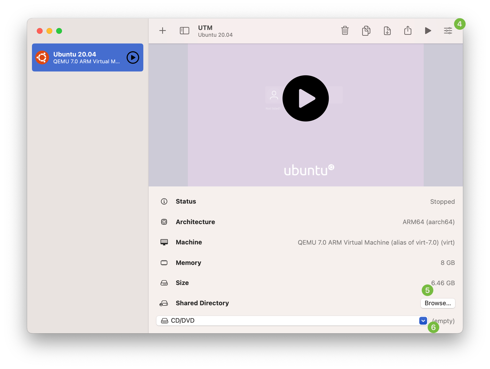

# 基础操作

<figure><figcaption></figcaption></figure>

 

<figure><figcaption></figcaption></figure>

1. 点击 "+" 按钮创建新虚拟机。
2. 选择一个虚拟机并显示具体信息，双击或通过 Force Touch（重按） 显示虚拟机的[设置界面](https://docs.getutm.app/basics/actions/)。
3. 点击启动按钮立即启动虚拟机。

<figure><figcaption></figcaption></figure>

 

<figure><figcaption></figcaption></figure>

4. 点击最右边的控制栏图标打开设置页面。
5. 点击“共享目录”中的“浏览”选择一个目录作为共享目录。
6. 打开驱动器菜单以装载（或移除）可移动磁盘镜像。


**Note**

虽然使用英文界面的图，但内容解释的是中文下的选项，如果您需要英文的内容解释请看 [UTM Documentation](https://docs.getutm.app/basics/basics)


此页面下的内容：

* [操作](actions.md)
* [控制](controls.md)
