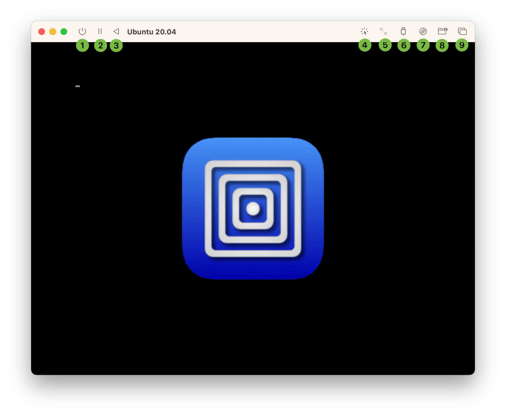
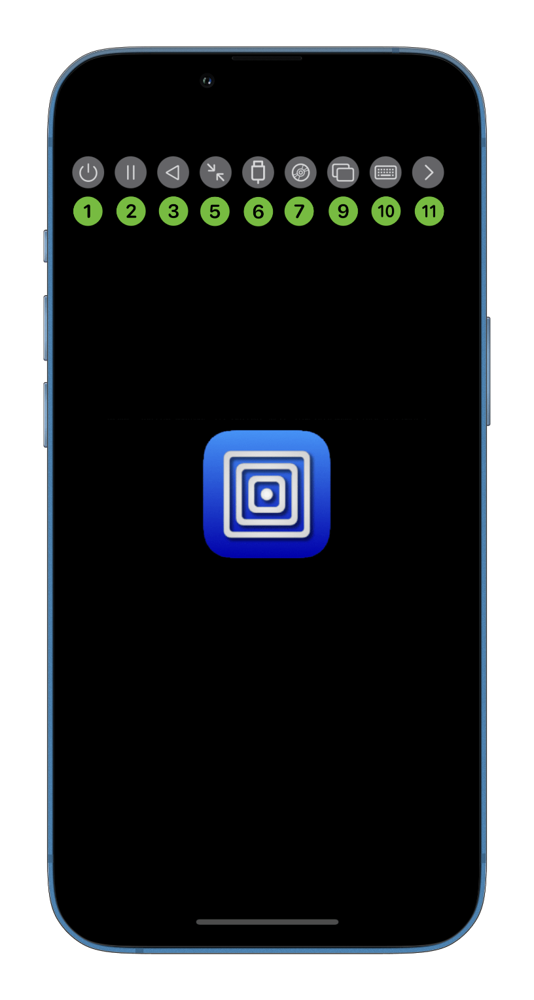

# 工具栏

<figure><figcaption></figcaption></figure>

 

<figure><figcaption></figcaption></figure>

1. 关闭虚拟机，这样将丢失所有未保存的数据，最好的选择是在虚拟机内操作系统中关机。 **(macOS)** 你可以长按此按键来选择其他关机选项。
   * &#x20;_“关机”_：向虚拟机发送关机请求。就像一台 PC 按下电源键那样。
   * _强制关机_：向 VM 进程发送停止命令，这样会有丢失数据的风险。就像按住 PC 的电源键强制关机那样。这是默认选项。
   * _强制终止_：强行杀死 VM 进程，有很大的概率导致数据损坏。
2. 挂起虚拟机（如果支持）。


**关于挂起**

如果虚拟机有设备在使用时不支持挂起那么挂起功能将无法使用。比如说虚拟 NVMe 设备以及带有 GPU 加速的显卡。另外，在英特尔平台上的 QEMU 虚拟化管理程序（当你使用 hvf）不支持挂起。


3. 重启虚拟机，这样将会丢失所以未保存的数据。
4. **(macOS)** 捕获鼠标和键盘，使虚拟机独占鼠标键盘。这样您就可以将某些组合键（比如 Cmd+Tab）发送到虚拟机。被捕获后可以通过 [Ctrl+Option 组合键](https://docs.getutm.app/preferences/macos/#use-commandoption-for-input-capturerelease)释放鼠标键盘，释放键鼠后也可以通过同样的组合键再次捕获键鼠。
5.  **(iOS)**在图形模式下，第一次点击时，虚拟机图像将覆盖全屏。当分辨率变化时，显示画面都会相应地缩放以便覆盖整个屏幕。第二次点击将设置并锁定显示画面缩放倍数为 1x。在终端模式下，第一次点击将发送 [重设大小命令（resize command）](https://docs.getutm.app/settings-qemu/devices/serial/#resize-console-command)，使终端窗口覆盖整个屏幕。

    **(macOS)** 这个按钮只在开启终端模式时可用，并与 iOS 上的行为作用一致。
6. 列出目前连接的 USB 设备，可以选择 USB 设备连接或断开。**(iOS)** UTM 标准构建或 UTM SE 不支持此选项。**(macOS)** 当使用 Apple 虚拟化后端时此选项不可用。如果不支持或[已禁用 USB 共享](https://docs.getutm.app/settings-qemu/input/#usb-sharing)，这个按钮将不可用或消失。
7. 当配置有一个或多个[可移除设备](https://docs.getutm.app/settings-qemu/drive/drive/)后，可以在此菜单更改要装载的镜像。**(iOS)** 当你使用 SPICE WebDAV 时，你也可以在此菜单更改共享目录。**(macOS)** 你也可以在此菜单下载和装载 [Windows guest tools](https://docs.getutm.app/guest-support/windows/)。当使用 Apple 虚拟化后端时此选项不可用。
8. **(macOS)** 可以在此菜单选择并更改 SPICE WebDAV [共享目录](https://docs.getutm.app/settings-qemu/sharing/)。当使用 Apple 虚拟化后端时此选项不可用。
9. 在此菜单切换到不同的[多个显示器](https://docs.getutm.app/advanced/multiple-displays/)。
10. **(iOS)** 显示或隐藏屏幕键盘。
11. **(iOS)** 显示或隐藏其他工具栏按钮。工具栏被隐藏时，如果长时间未出现触碰事件时，此按钮会消失，此时点击屏幕即可显示按钮。
