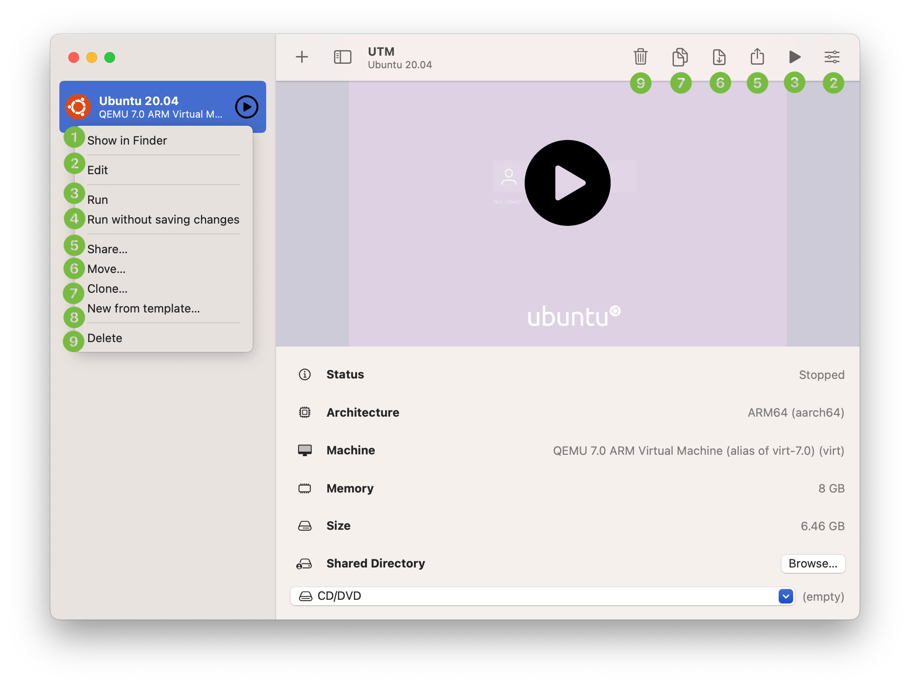
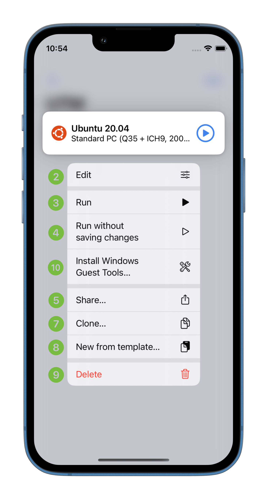
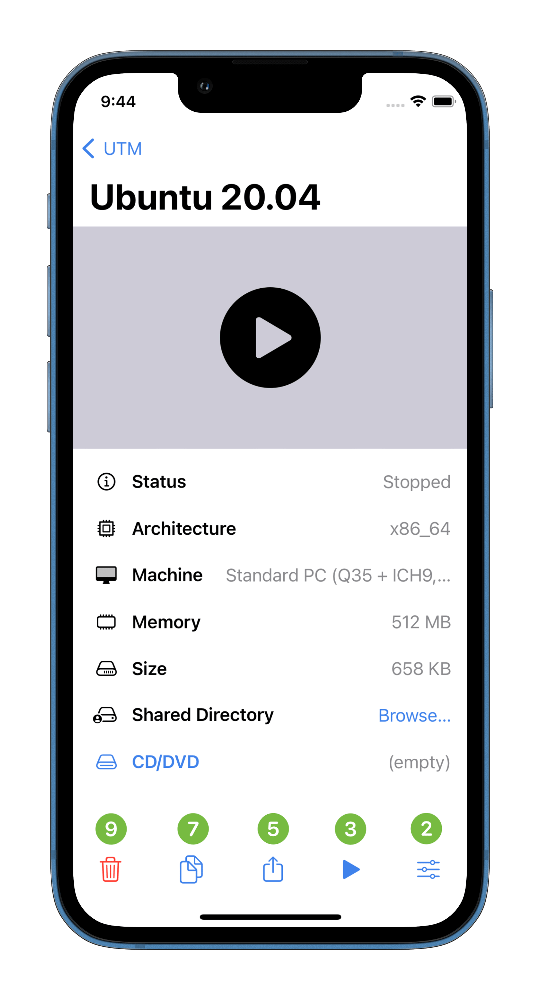

# 设置页面

可以双击或通过 Force Touch（重按）打开列表中虚拟机的设置界面。

<figure><figcaption></figcaption></figure>

<figure><figcaption></figcaption></figure>

 

<figure><figcaption></figcaption></figure>

1. **(macOS)** 在“访达”中打开虚拟机档案。
2. 打开虚拟机的编辑页面。
3. 运行虚拟机。
4. Run the virtual machine in [disposable mode](https://docs.getutm.app/advanced/disposable/) or [recovery mode](https://docs.getutm.app/advanced/recovery/) (depending on the VM).
5. 导出虚拟机及其所有数据。
6. **(macOS)** 将虚拟机转移到其他位置（比如移动硬盘）。
7. 创建一个带有完整数据的虚拟机备份。
8. 创建一个不包含数据的虚拟机配置备份。
9. 从列表中删除虚拟机，如果保存在默认路径（没有移动位置），那么虚拟机数据也会删除。
10. **(iOS)** 下载（如果您从未下载或已删除）Windows guest tools 并装载到虚拟机。 [Windows guest tools](https://docs.getutm.app/guest-support/windows/). 对于 macOS，这个选项在启动虚拟机后可以找到。  [after opening the virtual machine](https://docs.getutm.app/basics/controls/).
